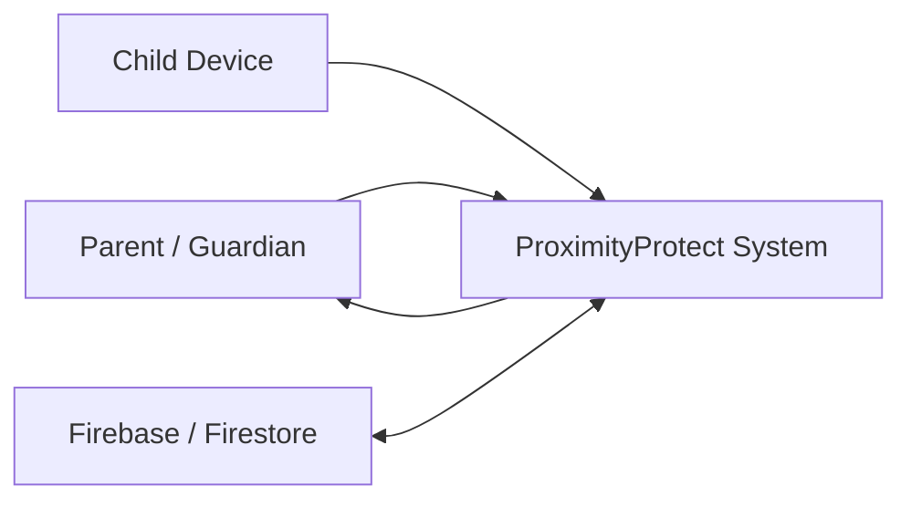
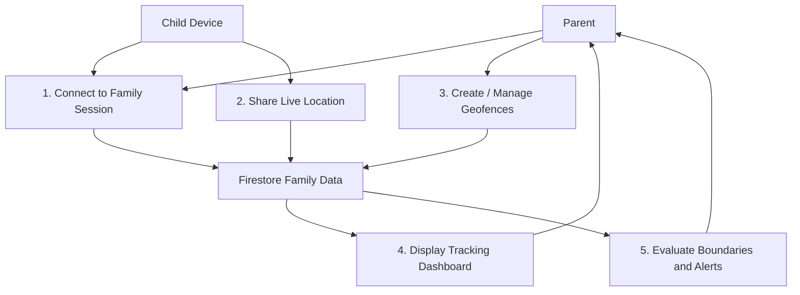
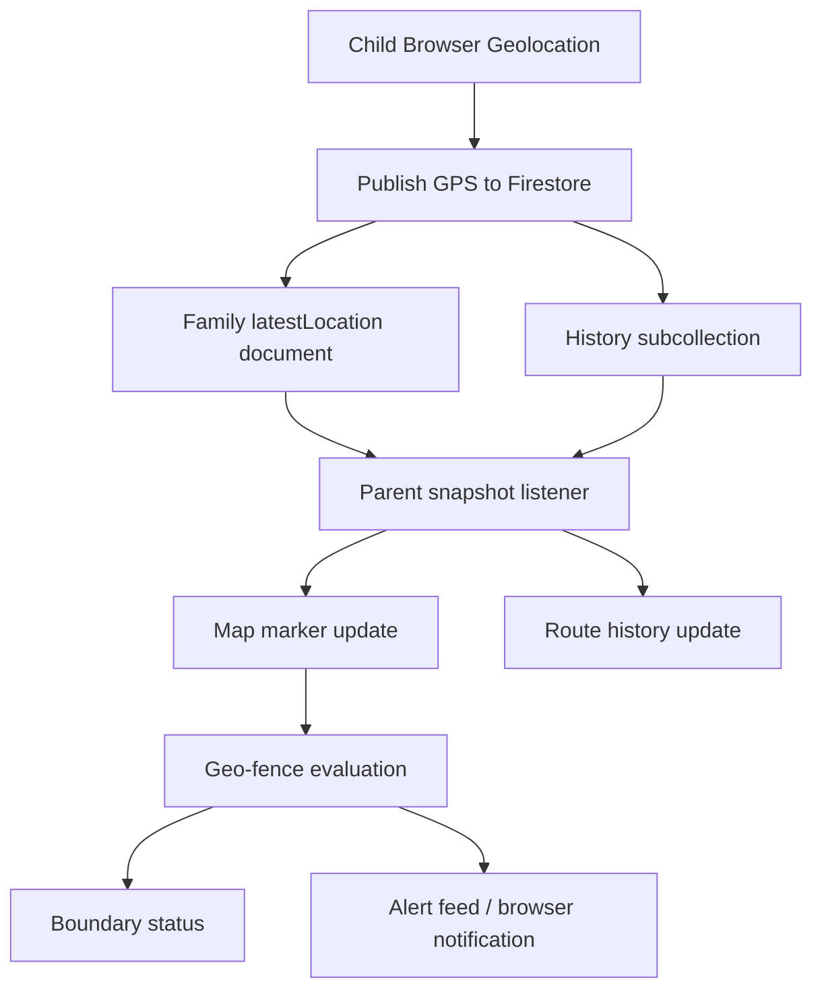
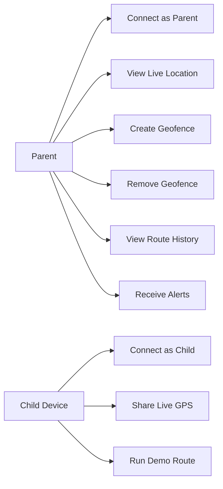
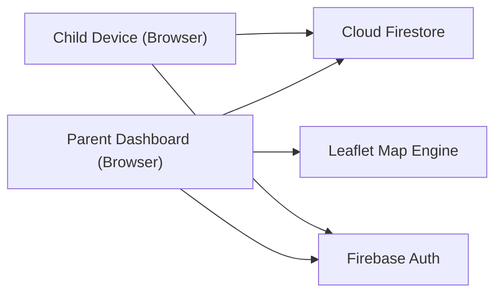

# ProximityProtect Project Report

## Title Page

**Project Title:** ProximityProtect - Child Safety Monitoring and Geo-Fencing System  
**Project Type:** Software Engineering Academic Project  
**Prepared By:** ____________________  
**Roll Number:** ____________________  
**Department:** ____________________  
**Institution:** ____________________  
**Academic Year:** 2025-2026  
**Submission Date:** ____________________

## Certificate (Optional)

This is to certify that the project report titled **"ProximityProtect - Child Safety Monitoring and Geo-Fencing System"** is a bona fide work carried out by **____________________** under the guidance of **____________________** for the fulfillment of the requirements of the Software Engineering course.

## Acknowledgement

I would like to express my sincere gratitude to my faculty guide, department, and institution for their guidance and support during the development of this project. I also thank my friends and family for their encouragement throughout the planning, development, testing, and documentation of ProximityProtect.

## Table of Contents

1. Problem Statement  
2. Requirement Analysis  
3. Project Management  
4. Design Engineering  
5. Coding  
6. Testing  
7. Results / Screenshots  
8. Conclusion  
9. Future Enhancements  
10. References

---

# 1. Problem Statement

## 1.1 Project Description

ProximityProtect is a child safety web application designed to help parents monitor their child’s location in real time. The system allows a parent to connect to a child device through a shared family code, view the child’s live position on a map, define safe zones using geo-fences, and receive alerts when the child enters or leaves those zones.  

The system includes:

- A landing page that introduces the platform and its features
- A real-time tracking dashboard
- Parent and child connection modes
- Geo-fence creation and management
- Route history
- Boundary-based alerts
- Firebase and Firestore-based backend synchronization

## 1.2 Problem Definition

In today’s world, parents are increasingly concerned about the safety and real-time whereabouts of their children, especially when children travel alone to school, tuition, playgrounds, or public places.

Existing solutions often:

- are too complex for everyday use
- do not provide simple geo-fence management
- do not provide instant and meaningful alerts
- do not support a lightweight parent-child connection model

Therefore, there is a need for a simple, reliable, and real-time system that enables parents to:

- track their child’s live location
- define safe zones
- receive immediate alerts when boundaries are crossed

## 1.3 Objectives

The objectives of ProximityProtect are:

- To provide real-time cross-device location tracking
- To allow parents to create named safe zones
- To notify parents when a child enters or exits a geo-fence
- To maintain a route history of the child’s recent movement
- To provide a simple and mobile-friendly user interface
- To build a system using modern web technologies with backend synchronization

## 1.4 Scope

The scope of the project includes:

- parent-child device pairing using a family code
- real-time location synchronization using Firebase/Firestore
- parent-side map visualization using Leaflet
- geo-fence drawing using circles, rectangles, and polygons
- route history and in-app alert feed
- responsive user interface for desktop and mobile

Out of scope for the current version:

- advanced user accounts with email/password authentication
- AI-based anomaly prediction engine
- emergency audio monitoring
- hardware tracker integration
- multi-child family account management

## 1.5 Users of the System

Primary users:

- Parents or guardians
- Children carrying a smartphone device

Secondary users:

- Academic evaluators reviewing the project
- Developers or testers validating the implementation

## 1.1 Process Model

### Model Used: Agile / Iterative Development

The project follows an Agile-inspired iterative process. Features were developed in small, testable increments:

- phase 1: landing page and project presentation
- phase 2: basic tracking UI
- phase 3: geo-fence drawing and alert logic
- phase 4: backend integration using Firebase
- phase 5: refinement, testing, and documentation

### Explanation

Agile was suitable because the project evolved gradually. The requirements became clearer as the interface, backend synchronization, and user flow were refined. Continuous iteration helped improve responsiveness, usability, and functionality.

### Advantages

- supports incremental development
- easier to improve UI based on feedback
- backend integration can be added after frontend validation
- suitable for student projects with changing scope
- allows testing after each meaningful change

---

# 2. Requirement Analysis

## 2.1 Data Flow Diagram (DFD)

### Level 0 DFD



### Level 1 DFD



### Level 2 DFD



## 2.2 Data Dictionary

| Data Item | Type | Description |
|---|---|---|
| familyCode | String | Unique shared code used by parent and child to join a session |
| childName | String | Name of the child associated with the session |
| latestLocation | Object | Current latitude, longitude, speed, accuracy, and timestamp |
| history | Collection | Stores route history points over time |
| geofences | Array | Stores all geo-fences for the family session |
| geofence.id | String | Unique identifier for each safe zone |
| geofence.name | String | User-defined safe zone name |
| geofence.category | String | Zone label such as Home, School, or Custom |
| geofence.shape | String | Shape type: circle, rectangle, polygon |
| geofence.center | Object | Center coordinate of a circular geo-fence |
| geofence.radius | Number | Radius of a circular geo-fence in meters |
| geofence.bounds | Array | Two corner points of a rectangular geo-fence |
| geofence.latlngs | Array | Polygon coordinates |
| alert | Object | Boundary event message with timestamp and tone |

## 2.3 Use Case Diagram



## 2.4 Software Requirement Specification (SRS)

### Functional Requirements

- The system shall allow a parent to connect to a family session using a family code.
- The system shall allow a child device to connect to the same family session.
- The system shall capture live GPS data from the child device.
- The system shall store and sync the latest location using Firestore.
- The system shall display the child location on a map.
- The system shall allow the parent to draw and name geo-fences.
- The system shall store geo-fences in the backend.
- The system shall detect whether the child is inside or outside a geo-fence.
- The system shall generate alerts on entry and exit events.
- The system shall maintain and display route history.
- The system shall support demo route publishing for testing.
- The system shall support responsive navigation and layout.

### Non-Functional Requirements

- The UI should be responsive on desktop, tablet, and mobile.
- The system should provide a clean and simple user experience.
- The backend should support near real-time updates.
- The system should be reliable enough for academic demonstration.
- The code should be modular and maintainable.

### Hardware Requirements

- Laptop or desktop for parent dashboard
- Smartphone with GPS for child device
- Internet connection on both devices
- Minimum 4 GB RAM recommended

### Software Requirements

- Modern web browser such as Chrome, Edge, or Firefox
- Firebase project with Firestore and Anonymous Authentication enabled
- Local web server or hosted environment
- HTML, CSS, JavaScript runtime in browser

### User Characteristics

- Parent users need basic smartphone and browser knowledge
- Child users require only simple interaction: connect and allow location
- The system is designed for non-technical everyday use

---

# 3. Project Management

## 3.1 Timeline Chart (Gantt Chart)

| Week | Activity |
|---|---|
| 1 | Problem identification and literature review |
| 2 | Requirement analysis and use case planning |
| 3 | UI wireframing and landing page design |
| 4 | Tracking dashboard design |
| 5 | Leaflet map and geo-fence implementation |
| 6 | Firebase backend integration |
| 7 | Route history and alert system |
| 8 | Responsive UI refinement |
| 9 | Testing and bug fixing |
| 10 | Documentation and final report preparation |

## 3.2 Transform to Design (Module Breakdown)

Main modules:

- Landing Page Module
- Navigation and Responsive Header Module
- Family Session Connection Module
- Child Location Publishing Module
- Parent Tracking Dashboard Module
- Geo-Fence Management Module
- Boundary Evaluation and Alert Module
- Route History Module
- Firebase Backend Module
- Testing and Verification Module

## 3.3 Function Point (FP) Calculation

Approximate Function Point analysis:

| Component | Count | Weight | Total |
|---|---:|---:|---:|
| External Inputs (EI) | 6 | 4 | 24 |
| External Outputs (EO) | 5 | 5 | 25 |
| External Inquiries (EQ) | 4 | 4 | 16 |
| Internal Logical Files (ILF) | 2 | 10 | 20 |
| External Interface Files (EIF) | 2 | 7 | 14 |
| **Unadjusted FP** |  |  | **99** |

Assuming a Value Adjustment Factor of 0.98:

**Adjusted FP = 99 x 0.98 = 97.02 ≈ 97 FP**

## 3.4 Effort Estimation

Assumption:

- 4 person-hours per function point for a student-scale web system

Effort:

**97 x 4 = 388 person-hours**

Approximate team interpretation:

- 3 students x 130 hours each

## 3.5 Cost Estimation

Assumption:

- Student project labor cost rate = INR 250/hour

Estimated cost:

**388 x 250 = INR 97,000**

Additional estimated services:

- Firebase free tier / low usage during academic demo
- Domain/hosting optional

## 3.6 Risk Analysis (Risk Table)

| Risk | Probability | Impact | Mitigation |
|---|---|---|---|
| GPS permission denied | Medium | High | Show clear message and allow demo mode |
| Firebase auth misconfiguration | Medium | High | Document setup and provide validation feedback |
| Firestore rules too open or too strict | Medium | High | Use tested starter rules and validate session access |
| Poor network connectivity | High | Medium | Use route persistence and status feedback |
| UI issues on mobile devices | Medium | Medium | Responsive CSS and mobile navbar |
| Incorrect geo-fence detection | Low | High | Test circle, rectangle, and polygon logic |
| Scope expansion beyond assignment timeline | Medium | Medium | Limit version 1 to core tracking and geo-fencing |

---

# 4. Design Engineering

## 4.1 Architectural Design

The project follows a lightweight client-backend architecture:

- Frontend: HTML, CSS, JavaScript
- Mapping: Leaflet and Leaflet Draw
- Backend: Firebase Authentication and Cloud Firestore
- Browser APIs: Geolocation API, Notifications API



## 4.2 System Design (Modules)

### Module 1: Landing Page

- Displays product information
- Highlights key features
- Routes user to tracking dashboard

### Module 2: Family Connection

- Accepts family code
- Connects as parent or child
- Shows connection feedback and role state

### Module 3: Child Location Sharing

- Uses browser geolocation
- Publishes location to Firestore
- Stores recent route history

### Module 4: Parent Dashboard

- Listens to session updates
- Displays map marker and route
- Shows alerts and current zone

### Module 5: Geo-Fence Management

- Allows drawing circles, rectangles, and polygons
- Saves names and categories
- Syncs to Firestore

### Module 6: Alert Engine

- Detects enter/exit of geo-fences
- Updates status labels
- Pushes alerts to feed and browser notifications

## 4.3 Database Design

Database used: **Cloud Firestore**

### Collection Structure

**families/{familyCode}**

| Field | Type | Description |
|---|---|---|
| familyCode | String | Shared session identifier |
| childName | String | Display name of child |
| latestLocation | Map | Most recent child location |
| geofences | Array | Saved geo-fence objects |
| createdAt | Timestamp | Session creation time |
| updatedAt | Timestamp | Last update time |
| createdBy | String | Parent creator UID |
| lastPublisherUid | String | Latest child publisher UID |

**families/{familyCode}/history/{historyId}**

| Field | Type | Description |
|---|---|---|
| lat | Number | Latitude |
| lng | Number | Longitude |
| speed | Number | Speed |
| accuracy | Number | GPS accuracy |
| sourceLabel | String | Source of route event |
| clientTimestamp | Number | Client-side timestamp |
| createdAt | Timestamp | Backend timestamp |

## 4.4 Pseudocode

### Pseudocode: Connect as Parent

```text
INPUT familyCode
IF familyCode is empty
    show error
ELSE
    authenticate anonymously
    create family record if not existing
    subscribe to family document
    subscribe to history collection
    update UI as parent mode
END IF
```

### Pseudocode: Connect as Child

```text
INPUT familyCode, childName
authenticate anonymously
update family record with childName
start geolocation watcher
FOR each location update
    publish latestLocation to Firestore
    add route history entry
END FOR
```

### Pseudocode: Evaluate Geo-Fence

```text
IF no latest location
    return
FOR each geofence
    check if point lies inside current shape
IF inside any geofence
    update zone label
    if zone changed -> create enter alert
ELSE
    mark outside all zones
    if previous zone existed -> create exit alert
END IF
```

---

# 5. Coding

## 5.1 Module Implementation

### Files Used

| File | Purpose |
|---|---|
| index.html | Landing page |
| assets/styles/style.css | Landing page styling |
| tracking.html | Main tracking dashboard UI |
| assets/styles/tracking.css | Tracking dashboard styling |
| assets/scripts/tracking.js | Real-time dashboard, Firebase, geo-fence, and alert logic |
| config/firebase-config.js | Firebase project configuration fallback |
| docs/FIREBASE_SETUP.md | Firebase setup instructions |
| docs/APPLICATION_USAGE_AND_VERIFICATION.txt | Usage and feature testing guide |

## 5.2 Key Code Snippets

### Firebase Initialization

```javascript
state.app = initializeApp(firebaseConfig);
state.auth = getAuth(state.app);
state.db = getFirestore(state.app);
```

### Parent Snapshot Listener

```javascript
state.unsubFamily = onSnapshot(familyDocRef(), (snapshot) => {
    const data = snapshot.data();
    renderGeofencesOnMap(Array.isArray(data.geofences) ? data.geofences : []);
    updateLocation({ lat: data.latestLocation.lat, lng: data.latestLocation.lng }, { silent: false });
});
```

### Child Location Publish

```javascript
await setDoc(familyDocRef(), {
    latestLocation: payload,
    childName: elements.childNameInput.value.trim() || "Alex Carter",
    updatedAt: serverTimestamp()
}, { merge: true });
```

### Geo-Fence Save

```javascript
setLayerMeta(state.pendingLayer, meta);
state.geofenceLayer.addLayer(state.pendingLayer);
syncGeofencesFromMap();
await persistGeofencesToBackend();
```

---

# 6. Testing

## 6.1 Testing Strategy

Testing types used:

- Functional testing
- UI testing
- Integration testing
- Browser-based manual testing
- Boundary logic validation

The focus of testing is:

- whether parent-child connection works
- whether live GPS updates reach the dashboard
- whether geo-fence logic is correct
- whether alerts appear as expected
- whether the UI remains responsive

## 6.2 Basis Path Testing

### Selected function: `evaluateCurrentPosition()`

Decision points:

1. Is latest location available?
2. Is child inside a geo-fence?
3. Has the zone changed?
4. Was the previous zone null or non-null?

Cyclomatic Complexity:

**V(G) = 4**

Independent paths:

- Path 1: no location available
- Path 2: location inside zone, no prior zone
- Path 3: location moves from one zone to outside
- Path 4: location moves from outside to inside zone

## 6.3 Test Cases

| Test ID | Test Case | Input | Expected Output |
|---|---|---|---|
| TC01 | Parent connection | Valid family code | Parent session connected |
| TC02 | Child connection | Valid family code and child name | Child sharing starts |
| TC03 | Invalid parent connect | Empty family code | Error feedback shown |
| TC04 | Live location update | Child moves location | Parent map and coordinates update |
| TC05 | Create circle geo-fence | Draw and save | Zone appears in list and map |
| TC06 | Create polygon geo-fence | Draw and save | Zone appears in list and map |
| TC07 | Enter geo-fence | Child moves inside | Enter alert generated |
| TC08 | Exit geo-fence | Child moves outside | Exit alert generated |
| TC09 | Route history | Multiple child updates | Route points increase |
| TC10 | Browser alerts | Notification permission granted | Notification appears on alert |
| TC11 | Remove geo-fence | Click remove | Zone deleted from UI and backend |
| TC12 | Mobile navigation | Small screen width | Hamburger menu works |

---

# 7. Results / Screenshots

## UI Screens

Suggested screenshots to include in final submission:

- Landing page home screen
- Tracking dashboard home state
- Parent connected state
- Child connected state
- Map with active geo-fence
- Route history and alerts panel
- Mobile responsive view with hamburger menu

## Output Results

Observed expected outputs:

- family session connection through shared code
- cross-device location sharing via Firebase
- live marker update on parent map
- geo-fence creation and deletion
- enter and exit alert generation
- route history display
- responsive UI across screen sizes

---

# 8. Conclusion

## Summary

ProximityProtect successfully demonstrates a real-time child safety monitoring system built using web technologies, Firebase, and mapping tools. The project solves the identified problem by enabling live location tracking, geo-fence creation, and instant safety alerts in a simple interface.

## Learning Outcomes

Through this project, the following concepts were learned and applied:

- software engineering documentation
- requirement analysis
- frontend UI/UX design
- real-time database integration
- geolocation and browser APIs
- responsive web design
- basic project planning and cost estimation
- test planning and validation

---

# 9. Future Enhancements

Possible future improvements include:

- secure user login using email, OTP, or phone authentication
- support for multiple children under one parent account
- AI-based anomaly detection for unusual routes
- SOS emergency button integration
- push notifications through Firebase Cloud Messaging
- battery status and device health monitoring
- admin analytics dashboard
- offline-first synchronization
- native Android/iOS app versions

---

# 10. References

1. Firebase Documentation  
2. Cloud Firestore Documentation  
3. Firebase Authentication Documentation  
4. Leaflet Documentation  
5. Leaflet Draw Documentation  
6. Remix Icon Documentation  
7. Software Engineering textbook and classroom notes

---

## Notes for Submission

- This report is written based on the implemented project files in the current codebase.
- Cost, effort, and function point values are academic estimates suitable for assignment documentation.
- AI anomaly detection is described as a conceptual or future feature, because the implemented version focuses on real-time tracking, geo-fencing, alerts, and backend synchronization.
